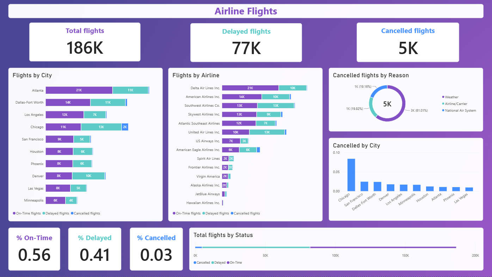

  

# Airline Dataset
#### A project using a mock airline dataset to refine and demonstrate my abilities in Power BI.

## Contents
- [Purpose](#purpose)  
- [Objectives](#objectives)  
- [Skills](#skills)  
- [Key Insights](#key-insights)  
- [Preview](#preview)   
- [Final Project](#final-project)

## Purpose
I created this project to demonstrate my Power BI skills as well as refine them. The dashboard especially showcases airline on-time, delayed, and cancelled flights, allowing flight activity to be analysed across cities, airlines, and cancellation reasons.

## Objectives
- Analyse the overall distribution of on-time, delayed, and cancelled flights.
- Compare flight activity across different cities and airlines.
- Investigate the main reasons for cancelled flights.
- Identify cities with higher numbers of cancelled flights.
- Create calculated measures and KPIs to visualise flight performance.
- Use appropriate visualisations to communicate patterns and trends clearly.  

## Skills
|  |   |
|---|---|
| Power BI | Interpreting results |
| DAX & Calculated measures | Communicating insights clearly |
| KPI development | Presenting data effectively |
| Data modelling | Visualising results clearly |
| Dashboard design |  |

## Key Insights 
- The dataset contains approximately **186K flights**, with around **77K delayed flights** and **5K cancelled flights**.
- Approximately **56% of flights were on-time**, while **41% were delayed** and **3% were cancelled**.
- **Atlanta** had the highest overall number of flights among the cities shown, followed by **Dallas-Fort Worth and Chicago**.
- **Delta Air Lines** had the highest overall number of flights among the airlines shown, followed by **Southwest Airlines and American Airlines**.
- **Chicago** had the highest proportion of cancelled flights among the cities shown in the cancellation-rate visualisation.
- **National Air System** was the largest cancellation reason, accounting for approximately **61% of cancelled flights**, followed by **Airline/Carrier** and **Weather**.
- In a professional setting, I would investigate these results further to understand why these specific insights were produced. For example, I would investigate why Chicago has the highest cancellation rate and hypothesise whether this may be related to weather conditions.

## Preview  

## Final Project

**[Airline Flights Dashboard](Final_Project/Airport_Flights_Dashboard.pbix)** 

###### Original datasets available in repository
